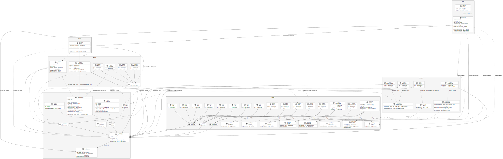

# Architecture
<div style="clear:both"></div>

Leonardo is structured as a layered set of packages. Dependencies point inward:
every domain package imports `core`; nothing imports `cli` or `parser`.

```
core  ←  scalar  ←  matrix  ←  equation  ←  parser  ←  cli
```

The diagram below is generated automatically from `docs/structure.puml` by
running `sbt puml` (or `sbt site` which runs the full pipeline).

## Class and package diagram

<div style="text-align:center;margin:24px 0">
  <object data="structure.svg" type="image/svg+xml"
          style="max-width:100%;width:100%;min-height:500px">
    
  </object>
</div>

## Package guide

| Package | Role | Documentation |
|---------|------|---------------|
| **`core`** | `_Expression` trait, `_Value` marker, `_Number`, `_Bool`, `_Complex`, `_Variable`, `_MatrixValue`, `Environment` — the foundation shared by every domain | [Expressions & Evaluation](expressions.md) |
| **`scalar`** | AST nodes (`Sum`, `Product`, `Power`, functions, functionals) and all algorithms: `derive`, `integrate`, `simplify`, `expand`, `normalize`, `compile`, `sample` | [Expressions & Evaluation](expressions.md) · [Calculus](calculus.md) |
| **`matrix`** | `_Matrix` symbolic node + `_MatrixOperation` nodes (`MatSum`, `MatProduct`, `MatScale`, `Transpose`); dense `_MatrixValue` kernels live in `core` | [Matrices](matrix.md) |
| **`equation`** | `_Equation` relation, `_EqualityCheck`, `_Solve`, `_SolveSystem` AST nodes; `solve` and `solveSystem` algorithms | [Equations & Complex Numbers](equations.md) |
| **`parser`** | Recursive-descent `Parser` (extends `JavaTokenParsers`); produces all AST node types; `ReservedWords` guard | [Getting Started](getting-started.md) |
| **`cli`** | Interactive `Session` (pure, IO-free core) + `repl` read loop; session scripts (`:save`/`:load`) | [Interactive REPL](repl.md) |

## Key design decisions

**Dual eval model** — `eval(env): Either[_Expression, _Value]` is the single
reduction point. `Right` means fully concrete; `Left` means one or more
variables remain free. Every node type implements it; no special dispatch needed.

**`_ElementWise` marker** — nodes that are plain containers (matrix literals,
matrix sums, transposes, equations) implement this trait. Algorithms such as
`derive`, `simplify`, and `expand` use `children`/`rebuild` to distribute
over them without domain-specific cases in the algorithm code.

**Memoization** — `derive` and `simplify` cache results in a bounded
`ConcurrentHashMap` (see `Memo.scala`). This is the biggest win for
`simplifyFully`'s fixpoint loop and for `_DefIntegral`'s Simpson integration,
which re-derives the same subexpressions hundreds of times per evaluation.

**`compile` fast path** — `compile(e, v, env): Option[Double ⇒ Double]`
translates an expression into a JVM closure when all nodes are compilable.
Used by `_DefIntegral` (Simpson's rule) and `sample`; eliminates per-step
AST allocation and environment lookup.
