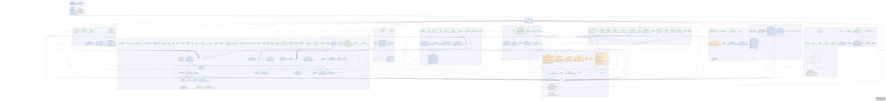

# Architecture
<div style="clear:both"></div>

Leonardo is structured as a layered set of packages. Dependencies point inward:
every domain package imports `core` (and usually `scalar`); nothing imports `cli` or
`parser`; the graph is a strict DAG.

```
                            cli
                          ┌──┴──┐
                       parser  latex
   ┌────────┬─────────┬──────┼──────┬─────────┬─────────┬────────┐
 matrix  equation  transform ode  logic  probability  domain  vector … control
   └────────┴─────────┴──────┴──────┴─────────┴─────────┴────────┘
                           scalar
                             │
                            core
```

The picture is a simplification — some domains also import each other in one direction
(`equation` imports `logic`, `statistics` imports `probability` and `matrix`, `control`
imports `transform` and `matrix`) — but the invariants hold everywhere: `core` imports no
domain, every arrow is one-way, and `parser` and `cli` sit above all of them.

`latex` sits in that top band too, and for a reason worth stating: **a renderer that must
match on `scalar.Sin` and `matrix._Matrix` cannot live in `core`**, which imports no domain.
So a domain-aware renderer sits *above* everything, as `parser` does, or is *distributed
across* the nodes, as `toString` is — there is no third place, which is why a `toLatex`
extension beside `toExpression` sounds obvious and is impossible.

## Modules

That layering is also the **artifact** boundary. Because nothing imports `cli`, it can be
published separately — and it is, so that a library consumer never resolves JLine:

| Artifact | Contains | Extra dependencies |
|---|---|---|
| `it.grypho:leonardo` | Every package except `cli` | `scala-parser-combinators`, `spire` |
| `it.grypho:leonardo-repl` | `cli` only; depends on `leonardo` | `jline` |

The split cost no code change, which is the practical dividend of the layering rule: `cli`
being a leaf that nothing imports is exactly what made it detachable. It also left the library
free of any terminal dependency — the one thing that would have blocked a Scala.js cross-build.

## Running off the JVM

Both modules **cross-build for Scala.js**, and the whole suite runs on Node as well as the JVM:
1828 library cases on each, plus the REPL's. The port needed two platform-specific pieces in
the library and four in the REPL; everything else is the same source.

| Platform-specific | Why |
|---|---|
| Parallel block dispatch | `java.util.stream` has no Scala.js counterpart, and a browser is single-threaded anyway |
| `Double` rendering | Scala.js renders a `Double` the JavaScript way — `1` for `1.0`, `0.00003` for `3.0E-5` |
| JLine read loop, highlighter | a terminal line editor has no meaning in a browser |
| `:save` / `:load` storage | files on the JVM, `localStorage` in a browser — **the same commands either way** |

The interesting part is what did *not* need changing. `Session` — the entire REPL behaviour,
including command parsing, display and session scripts — is untouched, because
`Session.execute`, `Session.script` and `Session.load` were already pure string in / string
out. The file system was the only JVM-bound part of `:save`, and it never lived inside
`Session`.

Nothing Scala.js is published yet: the cross-build exists to prove the library runs in a
browser and to keep that true, since CI runs the JavaScript suite on every push.

## The browser front end

A third project, `web`, is the page itself. It is JS-only, publishes nothing, and is kept out
of the root aggregate so that linking a bundle is never in the path of an ordinary library
change; CI names it explicitly instead.

**It is almost entirely not there**, which is the point. `Session.step` already dispatches
every command on both platforms, so the page is a text box, a transcript and a history ring.
Only two things are genuinely browser-only: the `plot` / `points` commands, which a terminal
cannot honour, and the shareable link.

The settings panel is the same argument again. It is generated from `Session.settings` — the
`(command, argument)` pairs `:save` already writes — and a changed control issues the command
a user would have typed, so the panel holds no state and there is nothing for it to disagree
with. Typing `latex on` at the prompt moves the checkbox, because the fields are refreshed
from the session after every line rather than tracked alongside it.

| Weight over the wire | |
|---|---|
| Leonardo, the whole CAS | 3.46 MB raw, **475 KB gzipped** |
| Plotly (`cartesian` distribution, vendored) | 1.3 MB raw, **436 KB gzipped** |
| MathLive (SSR — render-only — build, vendored) | 397 KB raw, **111 KB gzipped** |
| The KaTeX maths fonts | 254 KB, fetched **only when a formula needs them** |

About a megabyte for a computer algebra system with interactive plotting and typeset output,
which is what removed the one real risk in the plan: no module splitting and no lazy loading
is needed.

**Only MathLive's SSR build is vendored**, which is "rendering engine only" taken literally:
it exports the conversion functions and nothing else, so no mathfield element, no virtual
keyboard and none of the package's 232 KB of keyboard sounds ship — at half the weight of the
full build. Neither build bundles a second CAS: `@cortex-js/compute-engine` is looked up on
`globalThis` and its conversions simply decline when it is absent.

**Plotting adopts no Scala dependency.** Plotly's input is plain JSON, so the facade is a
string builder — pure, and therefore unit-tested without a browser. The one line of it that
chose Plotly over Vega-Lite is `scaleanchor`: a Nyquist diagram, a pole-zero map or a
two-element vector drawn as a point is *geometry*, and on unequal axes the unit circle becomes
an ellipse. Vega-Lite has no aspect lock, and deriving one from the data range stops holding
the moment the reader zooms — a confidently wrong picture rather than a refusal.

Nothing the user types leaves the tab: the CAS is in the bundle, sessions live in
`localStorage`, and a shared link carries its session in the URL **fragment**, which browsers
never transmit.

The diagram below is generated automatically from `docs/structure.puml` by
running `sbt puml` (or `sbt site` which runs the full pipeline).

## Class and package diagram

<div style="margin:24px 0">
  <div style="width:100%;height:75vh;border:1px solid #d0d0d8;border-radius:4px;overflow:hidden;background:#ffffff">
    <object id="structure-diagram" data="structure.svg" type="image/svg+xml"
            style="display:block;width:100%;height:100%">
      
    </object>
  </div>
  <p style="font-size:0.85em;color:#666;margin-top:6px;text-align:center">
    Drag to pan · scroll, double-click, or use the corner controls to zoom ·
    <a href="structure.svg" target="_blank" rel="noopener">open the diagram in its own tab</a>
  </p>
</div>
<script src="js/svg-pan-zoom.min.js"></script>
<script>
  (function () {
    var diagram = document.getElementById("structure-diagram");
    var started = false;
    function start() {
      // Same-origin embed, so contentDocument is readable; bail quietly otherwise
      // (e.g. a viewer with scripting disabled), leaving the plain embed and the
      // open-in-tab link as the fallback.
      if (started || !window.svgPanZoom) return;
      var doc = diagram.contentDocument;
      if (!doc || !doc.documentElement || doc.documentElement.nodeName !== "svg") return;
      started = true;
      // The diagram is ~37000 x 3700 units, so the fitted overview is ~2% scale and the
      // ceiling must allow ~50x before package-table text is comfortable.
      svgPanZoom(diagram, {
        zoomEnabled: true,
        controlIconsEnabled: true,
        fit: true,
        center: true,
        zoomScaleSensitivity: 0.3,
        minZoom: 0.8,
        maxZoom: 120
      });
    }
    diagram.addEventListener("load", start);
    if (diagram.contentDocument && diagram.contentDocument.readyState === "complete") start();
  })();
</script>

## Package guide

| Package | Role | Documentation |
|---------|------|---------------|
| **`core`** | `_Expression` trait, `_Value` marker, `_Number`, `_Bool`, `_Complex`, `_Rational`, `_Truth`, `_Based`, `_Variable`, `_MatrixValue`, `Environment` — the foundation shared by every domain | [Expressions & Evaluation](expressions.md) |
| **`scalar`** | AST nodes (`Sum`, `Product`, `Power`, functions, functionals) and all algorithms: `derive`, `integrate`, `simplify`, `expand`, `normalize`, `compile`, `sample`, series expansions, domain analysis, plus a data-driven rewrite-rule engine (`Rewrite`) backing the parameterised table of integrals (`IntegralRules`) | [Expressions & Evaluation](expressions.md) · [Calculus](calculus.md) |
| **`matrix`** | `_Matrix` symbolic node + `_MatrixOperation` nodes, constructors, the decompositions and `expm`; dense `_MatrixValue` kernels live in `core` | [Matrices](matrix.md) |
| **`equation`** | `_Equation`, `_Comparison`, `_EqualityCheck` relation nodes; `solve` (equations, inequalities, matrix unknowns) and `solveSystem` | [Equations & Complex Numbers](equations.md) |
| **`transform`** | Laplace, Fourier, inverse Laplace, and the one-sided z-transform and its inverse | [Features](features.md) |
| **`ode`** | `_ODE` node; closed-form linear and separable tiers, Runge–Kutta fallback | [Features](features.md) |
| **`logic`** | The five connectives over one Kleene/fuzzy rule table; simplification, CNF/DNF, truth tables, membership curves, defuzzification | [Logic](logic.md) |
| **`probability`** | Distributions as first-class values; `pdf`/`cdf`/`prob`/`quantile`; `expect`/`variance` by a linearity rule table | [Features](features.md) |
| **`statistics`** | Descriptive statistics, regression by QR, elementary inference (`ttest`, `confint`, `chisqtest`) | [Features](features.md) |
| **`domain`** | Renders the neutral domain analysis (`domain`, `differentiable`, `singularities`) into relation nodes | [Features](features.md) |
| **`vector`** | `grad`/`div`/`curl`/`laplacian`/`jacobian`/`hessian` over an ordered coordinate tuple, in three coordinate systems | [Calculus](calculus.md) |
| **`control`** | Transfer-function algebra, stability, time and frequency response, state space, discretisation | [Control Systems](control.md) |
| **`latex`** | `ToLatex(e)` — an expression as math-mode LaTeX source, display only; nothing reads it back | [Interactive REPL](repl.md#latex) |
| **`parser`** | Recursive-descent `Parser` (extends `JavaTokenParsers`); produces all AST node types; `ReservedWords` guard | [Getting Started](getting-started.md) |
| **`cli`** | Interactive `Session` (pure, IO-free core) + `repl` read loop; session scripts (`:save`/`:load`). **Ships as the separate `leonardo-repl` artifact** | [Interactive REPL](repl.md) |

## Key design decisions

**Dual eval model** — `eval(env): Either[_Expression, _Value]` is the single
reduction point. `Right` means fully concrete; `Left` means one or more
variables remain free. Every node type implements it; no special dispatch needed.

**`_ElementWise` marker** — nodes that are plain containers (matrix literals,
matrix sums, transposes, equations) implement this trait. Algorithms such as
`derive`, `simplify`, and `expand` use `children`/`rebuild` to distribute
over them without domain-specific cases in the algorithm code.

**Memoization** — `derive` and `simplify` cache results in a bounded
`ConcurrentHashMap` (see `Memo.scala`). This is the biggest win for
`simplifyFully`'s fixpoint loop and for `_DefIntegral`'s Simpson integration,
which re-derives the same subexpressions hundreds of times per evaluation.

**`compile` fast path** — `compile(e, v, env): Option[Double ⇒ Double]`
translates an expression into a JVM closure when all nodes are compilable.
Used by `_DefIntegral` (Simpson's rule) and `sample`; eliminates per-step
AST allocation and environment lookup.

**A new carrier type must earn its place** — a domain gets a `_Value` or a wrapper of its own
only when something must *read* a value as one. A vector field is an n×1 `_Matrix`; a
transfer function is an ordinary `Ratio`; a state-space model is the same 1×4 row of matrices
`lu` and `qr` already return; an inequality's solution set is a `_Comparison`. The reason is
that a carrier is a **wall**: `simplify`, `derive`, `substitute`, the exact tier and the
parser all operate on expressions, so a type outside that set would have to be taught to each
of them or be cut off from all of them. The price is paid in ergonomics — with no type to
dispatch on, `control` must take its frequency variable as an explicit argument everywhere —
and in documentation, which is why [Control Systems](control.md) opens by saying so.
